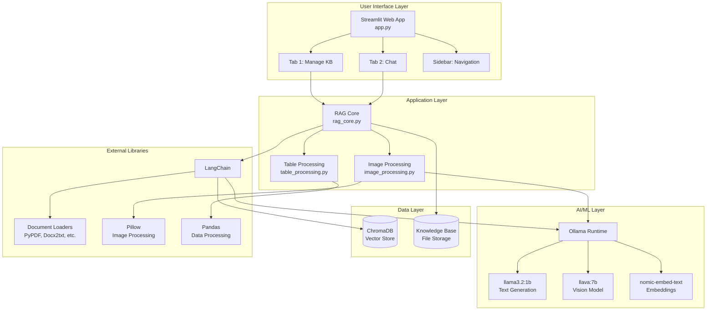
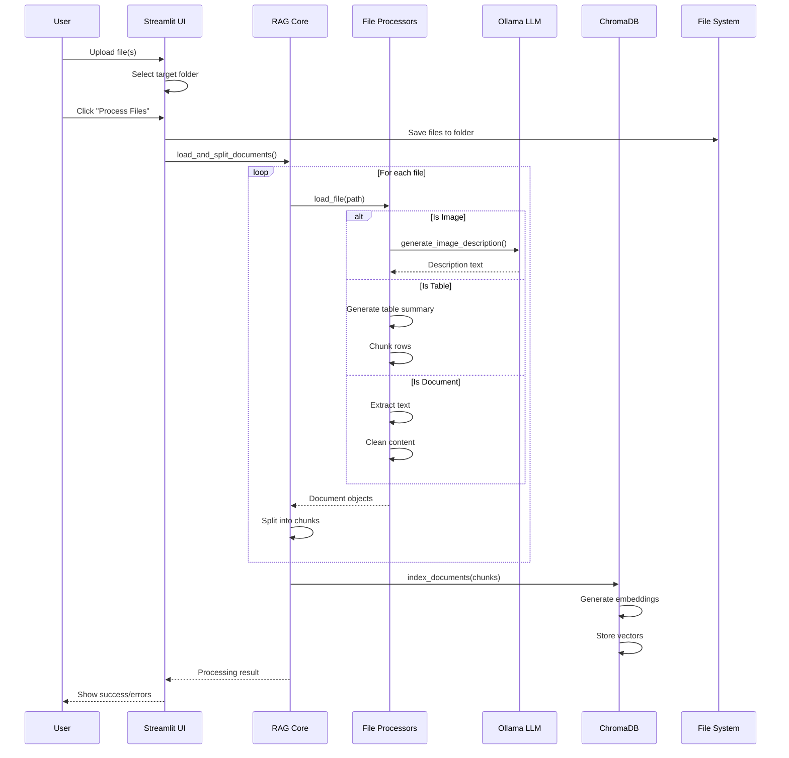
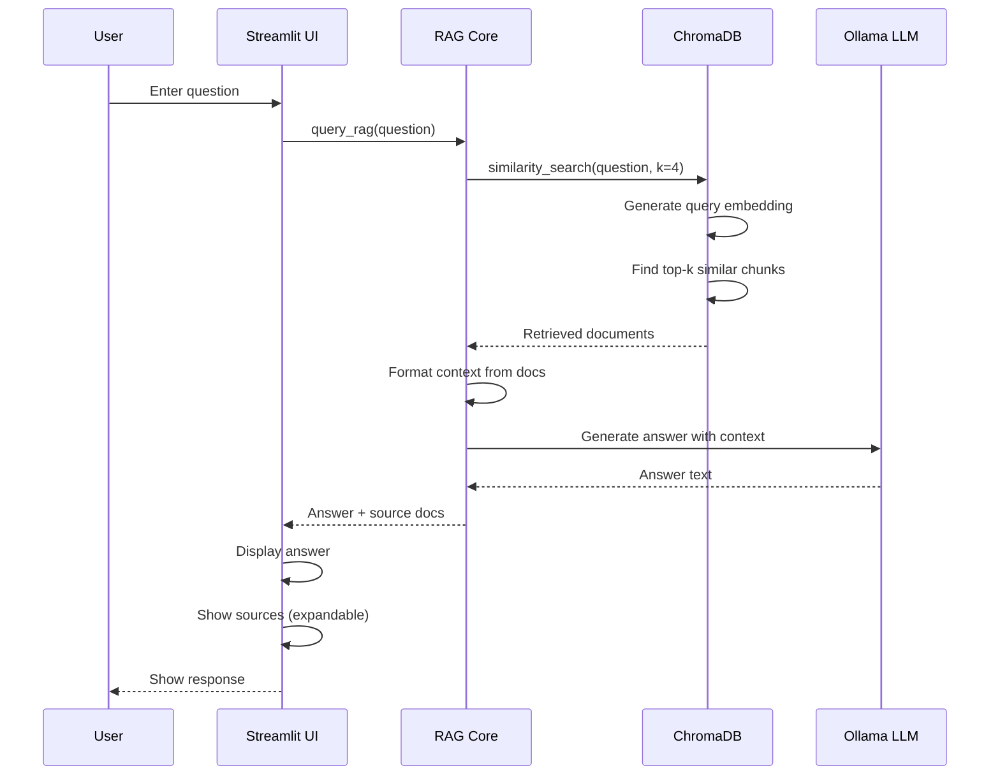

# Product Requirements Document (PRD)
# Learning Companion Multimodal RAG

**Version:** 1.0  
**Date:** November 28, 2025  
**Status:** Active Development  
**Product Owner:** Learning Companion Team

---

## Executive Summary

**Learning Companion Multimodal RAG** is a locally-hosted, privacy-focused AI-powered knowledge management and question-answering system designed for MBA students and educational institutions. The application leverages Retrieval-Augmented Generation (RAG) technology with multimodal capabilities to enable users to upload, organize, and interact with diverse educational content including documents, spreadsheets, presentations, and images.

**Key Value Proposition:**
- 100% local deployment ensuring complete data privacy and security
- Support for multiple file formats (PDF, DOCX, PPTX, XLSX, CSV, images)
- Intelligent multimodal processing with AI-powered image description
- Organized knowledge base management with hierarchical folder structure
- Conversational AI interface for natural language queries
- Zero API costs with locally-run open-source LLMs

---

## Table of Contents

1. [Product Overview](#product-overview)
2. [Vision & Goals](#vision--goals)
3. [Target Audience](#target-audience)
4. [User Personas](#user-personas)
5. [Use Cases](#use-cases)
6. [Functional Requirements](#functional-requirements)
7. [Technical Architecture](#technical-architecture)
8. [User Interface Specifications](#user-interface-specifications)
9. [Non-Functional Requirements](#non-functional-requirements)
10. [Success Metrics](#success-metrics)
11. [Future Roadmap](#future-roadmap)
12. [Appendix](#appendix)

---

## Product Overview

### Problem Statement

MBA students and learners face several challenges in managing and extracting insights from diverse educational materials:

1. **Information Overload**: Students receive content in multiple formats (slides, papers, spreadsheets, diagrams) making it difficult to synthesize information
2. **Privacy Concerns**: Cloud-based AI tools raise concerns about sharing proprietary or sensitive educational content
3. **Search Limitations**: Traditional file search doesn't understand context or meaning
4. **Fragmented Knowledge**: Educational materials scattered across different folders and formats
5. **Time Constraints**: Manual review of large document collections is time-intensive

### Solution

Learning Companion Multimodal RAG addresses these challenges by:

- **Unified Knowledge Base**: Centralized repository for all educational materials with semantic search
- **Local AI Processing**: Complete data privacy with on-premise LLM inference
- **Multimodal Understanding**: AI-powered processing of text, tables, and images
- **Smart Retrieval**: Context-aware search that understands questions semantically
- **Conversational Interface**: Natural language Q&A eliminating the need for manual document review

### Product Differentiation

| Feature | Learning Companion | Cloud AI Tools | Traditional Search |
|---------|-------------------|----------------|-------------------|
| **Data Privacy** | ✅ 100% Local | ❌ Cloud-based | ✅ Local |
| **Multimodal Support** | ✅ Text + Images | ⚠️ Limited | ❌ Text only |
| **Semantic Search** | ✅ RAG-powered | ✅ AI-powered | ❌ Keyword-based |
| **Cost** | ✅ Free (after setup) | ❌ API costs | ✅ Free |
| **Customization** | ✅ Fully customizable | ⚠️ Limited | ⚠️ Limited |
| **Offline Access** | ✅ Full functionality | ❌ Requires internet | ✅ Full functionality |

---

## Vision & Goals

### Product Vision

*"To empower learners with an intelligent, privacy-preserving AI assistant that transforms fragmented educational content into an accessible, conversational knowledge base."*

### Strategic Goals

1. **Privacy First**: Enable students and institutions to leverage AI without compromising data security
2. **Accessibility**: Make advanced RAG technology accessible to non-technical users
3. **Comprehensive Support**: Handle all common educational file formats seamlessly
4. **Scalability**: Support knowledge bases from dozens to thousands of documents
5. **User Empowerment**: Give users complete control over their knowledge organization

### Success Criteria

- ✅ Process and index documents with >95% accuracy
- ✅ Answer queries with <5 second response time
- ✅ Support 7 different file formats
- ✅ Enable users to manage 1000+ documents efficiently
- ✅ Maintain zero data leakage to external services

---

## Target Audience

### Primary Audience

**MBA Students & Graduate Learners**
- Age: 22-45
- Tech proficiency: Intermediate
- Primary need: Quickly extract insights from course materials
- Pain points: Time-constrained, information overload, need for synthesis

### Secondary Audiences

1. **Educational Institutions**
   - Universities and business schools
   - Need: Provide students with AI tools while maintaining data security
   - Constraint: Budget limitations, privacy regulations

2. **Corporate Trainers**
   - Learning & Development professionals
   - Need: Quick access to training materials
   - Use case: Employee onboarding, skills training

3. **Researchers**
   - Academic and industry researchers
   - Need: Literature review and knowledge synthesis
   - Requirement: Privacy for proprietary research

---

## User Personas

### Persona 1: Sarah - MBA Student

**Demographics:**
- Age: 28
- Role: Full-time MBA student at BPGP
- Technical skill: Intermediate
- Location: Urban university

**Goals:**
- Efficiently study for exams across multiple courses
- Synthesize information from lectures, textbooks, and case studies
- Maintain organized study materials

**Pain Points:**
- Overwhelmed by volume of reading materials
- Struggles to find specific information across documents
- Limited time for manual document review
- Privacy concerns with cloud AI tools

**Usage Pattern:**
- Uploads course materials weekly
- Asks 20-30 questions per study session
- Organizes by course/module
- Peak usage during exam periods

### Persona 2: Dr. Kumar - University Professor

**Demographics:**
- Age: 45
- Role: MBA Program Director
- Technical skill: Advanced
- Location: Business school

**Goals:**
- Provide students with modern learning tools
- Ensure institution data stays secure
- Enable efficient research for students
- Track learning resource utilization

**Pain Points:**
- Budget constraints for expensive AI tools
- Data privacy compliance requirements
- Need for customization to curriculum
- Limited IT support for cloud deployments

**Usage Pattern:**
- Deploys for entire class (50+ students)
- Pre-loads reference materials
- Monitors system performance
- Requires detailed documentation

### Persona 3: Mark - Corporate L&D Manager

**Demographics:**
- Age: 35
- Role: Learning & Development Manager
- Technical skill: Intermediate
- Location: Large enterprise

**Goals:**
- Efficient onboarding for new hires
- Quick access to company policies and training materials
- Reduce time-to-competency for employees
- Maintain confidentiality of proprietary content

**Pain Points:**
- Scattered training materials across systems
- Employees struggle to find information quickly
- Compliance requirements prevent cloud AI usage
- Need for cost-effective solutions

**Usage Pattern:**
- Uploads company handbooks, policies, training guides
- Multiple users across organization
- Queries on policies, procedures, and technical documentation
- Quarterly content updates

---

## Use Cases

### UC-01: Upload and Process Course Materials

**Actor:** MBA Student

**Preconditions:**
- Application is running
- User has course materials in supported formats

**Main Flow:**
1. User navigates to "Manage Knowledge Base" tab
2. User selects or creates target folder (e.g., "Marketing 101")
3. User chooses upload mode (single or batch)
4. User selects files from local system
5. System displays selected files for confirmation
6. User clicks "Process Files"
7. System shows progress bar with current file name
8. System processes each file:
   - Extracts text from documents
   - Generates descriptions for images
   - Structures tabular data
9. System indexes content into vector database
10. System displays success message with processing summary

**Postconditions:**
- Files are saved in selected folder
- Content is indexed and searchable
- Files appear in sidebar explorer

**Alternative Flows:**
- **AF-01**: Unsupported file type → System ignores with warning
- **AF-02**: Processing fails for a file → System logs error, continues with others
- **AF-03**: Batch upload via ZIP → System extracts and processes all files

**Success Metrics:**
- Processing success rate >95%
- Average processing time: <5 seconds per file
- User can find uploaded files in explorer

---

### UC-02: Query Knowledge Base

**Actor:** Student/Learner

**Preconditions:**
- Knowledge base contains indexed documents
- Application is running

**Main Flow:**
1. User navigates to "Chat with Knowledge Base" tab
2. User types question in natural language (e.g., "What are the 4 Ps of marketing?")
3. System retrieves top 4 most relevant document chunks
4. System generates context-aware answer using LLM
5. System displays answer to user
6. System shows expandable "Source Documents" section
7. User expands sources to see:
   - Source file names
   - Relevant excerpts
   - Images (if applicable)

**Postconditions:**
- Answer is displayed
- Conversation history is maintained in session
- Sources are available for verification

**Alternative Flows:**
- **AF-01**: No relevant documents found → System responds "I don't know"
- **AF-02**: User asks follow-up question → System maintains context
- **AF-03**: Query on image content → System uses image descriptions

**Success Metrics:**
- Answer relevance score >80%
- Response time <5 seconds
- Source attribution accuracy 100%

---

### UC-03: Organize Knowledge Base with Folders

**Actor:** Power User (Student/Professor)

**Preconditions:**
- Application is running
- Knowledge base exists

**Main Flow:**
1. User opens sidebar folder actions
2. User selects "Create Subfolder"
3. User chooses parent folder from dropdown
4. User enters new folder name (e.g., "Financial Accounting")
5. System creates folder
6. System refreshes folder explorer
7. New folder appears in hierarchy

**Postconditions:**
- New folder is created
- Folder is available for file uploads
- Folder structure is persisted

**Alternative Flows:**
- **AF-01**: Delete folder
  - User selects "Delete Folder"
  - User chooses folder to delete
  - System removes folder and contents
  - System updates explorer
- **AF-02**: Folder already exists → System shows warning

**Success Metrics:**
- Folder operations complete instantly
- No data loss during folder operations

---

### UC-04: Quick Upload During Chat

**Actor:** Student

**Preconditions:**
- User is in chat tab
- User has a new document to reference

**Main Flow:**
1. User is actively chatting with AI
2. User realizes they need to add a new document
3. User uses "Quick Upload" feature in chat tab
4. User selects single file
5. User clicks "Add to Context"
6. System processes file immediately
7. System adds document to knowledge base
8. User continues asking questions about new content

**Postconditions:**
- Document is indexed
- Document is immediately available for queries
- Temporary file is cleaned up

**Alternative Flows:**
- **AF-01**: Processing fails → System shows error, chat continues

**Success Metrics:**
- Quick upload completes in <10 seconds
- Zero disruption to chat flow

---

### UC-05: Reset System and Start Fresh

**Actor:** System Administrator/Power User

**Preconditions:**
- Application is running
- User wants to clear all data

**Main Flow:**
1. User navigates to sidebar "System Settings"
2. User reads warning about permanent deletion
3. User checks confirmation box ("I understand this will delete ALL data permanently")
4. User clicks "Reset Everything" button
5. System displays confirmation dialog
6. User confirms deletion
7. System deletes:
   - All files in `knowledge_base/` folder
   - All vector embeddings in `chroma_db/` folder
   - All folder structures
8. System recreates empty base structure
9. System displays success message
10. User refreshes page

**Postconditions:**
- All user data is permanently deleted
- System is restored to fresh state
- Default folders are recreated

**Alternative Flows:**
- **AF-01**: User doesn't confirm → Button remains disabled
- **AF-02**: Deletion fails → System shows error, data preserved

**Success Metrics:**
- 100% data deletion
- System recovers to functional state
- Clear user feedback throughout

---

## Functional Requirements

### FR-01: Document Upload & Processing

#### FR-01.1: Supported File Formats
**Priority:** MUST HAVE

The system SHALL support the following file formats:
- **Documents**: PDF (`.pdf`), Word (`.docx`)
- **Presentations**: PowerPoint (`.pptx`, `.ppt`)
- **Spreadsheets**: Excel (`.xlsx`), CSV (`.csv`)
- **Images**: JPEG (`.jpg`, `.jpeg`), PNG (`.png`), GIF (`.gif`), WebP (`.webp`)
- **Archives**: ZIP (`.zip`) for batch upload

#### FR-01.2: File Processing Pipeline
**Priority:** MUST HAVE

For each file type, the system SHALL:

**PDF Processing:**
- Extract text using PyPDFLoader
- Remove header/footer artifacts (e.g., "BPGP 2024-26 Batch")
- Preserve page numbers in metadata
- Handle scanned PDFs (best effort)

**DOCX Processing:**
- Extract and remove headers/footers using python-docx
- Preserve document structure
- Extract text content only

**PPTX/PPT Processing:**
- Extract slide text using UnstructuredPowerPointLoader
- Preserve slide order
- Include notes if present

**XLSX/CSV Processing:**
- Load into pandas DataFrame
- Generate table summary with:
  - Row/column counts
  - Column names and data types
  - Numeric statistics (min, max, mean, median)
  - Sample values for text columns
- Create chunks of 50 rows with full column headers
- Include chunk statistics

**Image Processing:**
- Use multimodal LLM (llava:7b) to generate descriptions
- Description SHALL include:
  1. Main subjects/objects
  2. Colors and visual style
  3. Text content (OCR-like)
  4. Overall purpose/context
- Store image path for display
- Create document with description as searchable content

#### FR-01.3: Text Chunking
**Priority:** MUST HAVE

The system SHALL:
- Split documents using RecursiveCharacterTextSplitter
- Default chunk size: 1000 characters
- Default chunk overlap: 200 characters
- Preserve semantic boundaries (paragraphs, sentences)
- Images: No chunking (single chunk per image)
- Tables: Chunk every 50 rows with headers repeated

#### FR-01.4: Progress Feedback
**Priority:** MUST HAVE

During processing, the system SHALL:
- Display progress bar (0-100%)
- Show current file being processed
- Show count (e.g., "Processing file 3/15: filename.pdf")
- Display final summary:
  - Success count
  - Failed files with error messages
  - Ignored files (unsupported formats)

#### FR-01.5: Error Handling
**Priority:** MUST HAVE

The system SHALL:
- Continue processing remaining files if one fails
- Log all errors with file names
- Display errors to user after processing
- Never crash due to individual file failures
- Provide actionable error messages

---

### FR-02: Knowledge Base Management

#### FR-02.1: Folder Structure
**Priority:** MUST HAVE

The system SHALL:
- Create `knowledge_base/` root directory on startup
- Create default `knowledge_base/Others/` folder
- Support unlimited nested folder levels
- Persist folder structure across sessions
- Display folder hierarchy in sidebar

#### FR-02.2: Folder Operations
**Priority:** MUST HAVE

**Create Folder:**
- User selects parent folder (or "/" for root)
- User enters folder name
- System validates name (no special characters, not empty)
- System creates folder immediately
- System refreshes UI

**Delete Folder:**
- User selects folder from dropdown
- System shows folder path for confirmation
- User clicks delete button
- System recursively deletes folder and all contents
- System updates UI

**Folder Explorer:**
- Hierarchical tree view in sidebar
- Expandable/collapsible folders
- Icons for different file types:
  - 📁 Folders
  - 📕 PDF files
  - 📝 DOCX files
  - 📊 XLSX/CSV files
  - 📊 PPTX/PPT files
  - 🖼️ Image files
  - 📄 Other files
- Real-time updates

#### FR-02.3: File Selection
**Priority:** MUST HAVE

The system SHALL:
- Provide dropdown to select target folder
- Show hierarchical folder names with indent (e.g., "— 📁 Subfolder")
- Default to "Others" folder
- Persist selection during session
- Show warning before processing to confirm target folder
- Save files to selected folder on upload

---

### FR-03: Vector Database & Retrieval

#### FR-03.1: Embedding Generation
**Priority:** MUST HAVE

The system SHALL:
- Use Ollama embedding model: `nomic-embed-text`
- Generate embeddings for all text chunks
- Store embeddings in ChromaDB
- Persist embeddings in `chroma_db/` directory
- Support incremental additions (no full rebuild needed)

#### FR-03.2: Semantic Search
**Priority:** MUST HAVE

The system SHALL:
- Perform similarity search on query
- Retrieve k=4 most relevant chunks by default
- Use cosine similarity for ranking
- Include metadata in results (source, type, filename)
- Support queries while files are being added

#### FR-03.3: Metadata Storage
**Priority:** MUST HAVE

Each document chunk SHALL store:
- `source`: Full file path
- `filename`: File name only
- `type`: Document type (document, table_summary, table_chunk, image)
- `extension`: File extension
- Additional type-specific metadata:
  - **Tables**: columns, row_count, column_count, chunk_index
  - **Images**: None (path is sufficient)

---

### FR-04: Conversational AI Interface

#### FR-04.1: Question Answering
**Priority:** MUST HAVE

The system SHALL:
- Accept natural language questions via chat input
- Retrieve relevant document chunks (k=4)
- Format context from chunks
- Generate answer using local LLM (llama3.2:1b)
- Use prompt template:
  ```
  You're an MBA Knowledge Base. Use the following pieces of context to answer 
  the question at the end to the students. If you don't know the answer, 
  just say that you don't know, don't try to make up an answer. 
  Use three sentences maximum and keep the answer concise.
  
  Context: {context}
  
  Question: {question}
  
  Helpful Answer:
  ```
- Display answer in chat message
- Maintain conversation history in session
- Support follow-up questions

#### FR-04.2: Source Attribution
**Priority:** MUST HAVE

For each answer, the system SHALL:
- Display expandable "📚 Source Documents" section
- Show for each source:
  - Source number (Source 1, Source 2, etc.)
  - File name (basename only)
  - Document type (e.g., "image", "table_chunk", "document")
  - Content preview (first 300 characters)
  - Full image display (if type is "image")
- Support up to 4 sources per answer

#### FR-04.3: Chat History
**Priority:** MUST HAVE

The system SHALL:
- Maintain chat history in `st.session_state.messages`
- Display all messages in chat interface
- Support unlimited message history per session
- Clear history on page refresh
- Indicate user vs. assistant messages with icons

#### FR-04.4: Quick Upload in Chat
**Priority:** SHOULD HAVE

The system SHALL:
- Provide file uploader in chat tab
- Support single file upload only
- Process file immediately
- Add to knowledge base
- Show success confirmation
- Clean up temporary files
- Enable immediate querying of newly uploaded file

---

### FR-05: System Management

#### FR-05.1: Reset Functionality
**Priority:** MUST HAVE

The system SHALL:
- Provide "Reset Everything" button in sidebar
- Require explicit user confirmation via checkbox
- Display danger warning in red/orange
- Delete on confirmation:
  - `knowledge_base/` folder and all contents
  - `chroma_db/` folder and all contents
- Recreate empty folder structure:
  - `knowledge_base/`
  - `knowledge_base/Others/`
- Show clear success/error messages
- Suggest page refresh after reset

#### FR-05.2: Configuration
**Priority:** SHOULD HAVE

The system SHALL support configuration via `rag_core.py`:
- LLM model selection
  - `MODEL_NAME`: Text generation model (default: llama3.2:1b)
  - `MULTIMODAL_MODEL`: Image processing model (default: llava:7b)
  - `EMBEDDING_MODEL`: Embedding model (default: nomic-embed-text)
- Chunking parameters
  - `chunk_size`: Max characters per chunk (default: 1000)
  - `chunk_overlap`: Overlap between chunks (default: 200)
- Retrieval parameters
  - `k`: Number of chunks to retrieve (default: 4)

#### FR-05.3: Port Configuration
**Priority:** SHOULD HAVE

The system SHALL:
- Support custom port via command-line flag
- Default to port 8501 (Streamlit default)
- Example: `streamlit run app.py --server.port 8055`

---

### FR-06: User Interface

#### FR-06.1: Layout
**Priority:** MUST HAVE

The system SHALL:
- Use Streamlit wide layout
- Provide persistent sidebar for navigation and settings
- Implement two main tabs:
  1. "Manage Knowledge Base" (Upload & organize)
  2. "Chat with Knowledge Base" (Query & interact)

#### FR-06.2: Visual Feedback
**Priority:** MUST HAVE

The system SHALL provide:
- Progress indicators for long operations
- Success messages (green)
- Warning messages (yellow/orange)
- Error messages (red)
- Info messages (blue)
- Loading spinners during processing
- Clear button states (enabled/disabled)

#### FR-06.3: Responsive Design
**Priority:** SHOULD HAVE

The system SHALL:
- Support desktop browsers (Chrome, Firefox, Edge, Safari)
- Support minimum resolution: 1280x720
- Adapt to browser window resizing
- Provide scrollable content areas

---

## Technical Architecture

### Architecture Overview



### Technology Stack

#### Frontend
- **Framework**: Streamlit 1.x
- **Language**: Python 3.9+
- **UI Components**: Native Streamlit widgets

#### Backend
- **Framework**: LangChain (latest)
- **Language**: Python 3.9+
- **Core Modules**:
  - `app.py`: Main application and UI logic
  - `rag_core.py`: RAG pipeline, document processing, query handling
  - `image_processing.py`: Multimodal image processing
  - `table_processing.py`: Structured data processing

#### AI/ML Infrastructure
- **LLM Runtime**: Ollama (local inference server)
- **Text Generation**: Llama 3.2 1B (~1.3GB)
- **Vision Model**: LLaVA 7B (~4.7GB)
- **Embeddings**: Nomic Embed Text (~274MB)
- **Orchestration**: LangChain Expression Language (LCEL)

#### Data Storage
- **Vector Database**: ChromaDB (persistent local storage)
- **File Storage**: Local file system (`knowledge_base/` directory)
- **Persistence**: `chroma_db/` for embeddings

#### Document Processing
- **PDF**: PyPDF, pypdf
- **Word**: python-docx, Docx2txtLoader
- **PowerPoint**: python-pptx, UnstructuredPowerPointLoader
- **Excel**: openpyxl, pandas, UnstructuredExcelLoader
- **CSV**: pandas, CSVLoader
- **Images**: Pillow (PIL)

#### Supporting Libraries
- **Data Processing**: pandas, tabulate
- **Text Splitting**: LangChain RecursiveCharacterTextSplitter
- **Embeddings**: LangChain Ollama Embeddings
- **Prompting**: LangChain PromptTemplate

### System Requirements

#### Minimum Requirements
- **OS**: Windows 10/11, macOS, Linux
- **CPU**: 4 cores, 2.0 GHz
- **RAM**: 8 GB
- **Storage**: 10 GB free space
- **Python**: 3.9 or higher
- **Ollama**: Latest version
- **GPU**: Optional (improves performance)

#### Recommended Requirements
- **OS**: Windows 11, macOS 12+, Ubuntu 22.04+
- **CPU**: 8 cores, 3.0 GHz
- **RAM**: 16 GB or more
- **Storage**: 50 GB SSD
- **Python**: 3.10+
- **Ollama**: Latest version
- **GPU**: NVIDIA GPU with 6GB+ VRAM (for faster inference)

### Data Flow

#### Upload Flow


#### Query Flow


### Security Considerations

#### Data Privacy
- ✅ **100% Local Processing**: No data leaves local machine
- ✅ **No API Calls**: All LLM inference is local
- ✅ **No Telemetry**: No usage tracking or analytics
- ✅ **File Isolation**: Knowledge base contained in designated folder

#### Access Control
- ⚠️ **Single User**: No authentication system (designed for personal use)
- ⚠️ **Localhost Only**: Default Streamlit config restricts to 127.0.0.1
- ⚠️ **No Encryption**: Files stored unencrypted on disk

> [!WARNING]
> The current version is designed for personal, local use. For multi-user deployments, consider adding:
> - User authentication
> - File encryption at rest
> - Network security (HTTPS, firewall rules)
> - Access control lists (ACLs)

#### Input Validation
- ✅ File type validation (extension-based)
- ✅ Error handling for corrupted files
- ✅ Folder name sanitization
- ⚠️ No file size limits (could allow DoS via large files)

### Scalability Considerations

#### Current Limitations
- **Vector DB Size**: ChromaDB performs well up to ~100K chunks
- **LLM Context Window**: Limited by model (typically 2048-4096 tokens)
- **Memory**: Image processing model (LLaVA) requires ~8GB RAM
- **Concurrent Users**: Streamlit designed for 1-10 concurrent users

#### Scaling Strategies
1. **Horizontal Scaling**: Deploy multiple instances per user
2. **Model Optimization**: Use smaller models for lower memory footprint
3. **Batch Processing**: Process uploads asynchronously
4. **Database Sharding**: Split knowledge base by topic/course

---

## User Interface Specifications

### Color Scheme & Styling

The application uses Streamlit's default theme with semantic colors:
- **Success**: Green (#00C851)
- **Warning**: Orange/Yellow (#FFBB33)
- **Error**: Red (#FF4444)
- **Info**: Blue (#33B5E5)
- **Primary**: Streamlit blue

### Layout Specifications

#### Overall Layout
```
┌─────────────────────────────────────────────────────┐
│  Local Multimodal RAG Assistant       [Page Title]  │
├──────────────┬──────────────────────────────────────┤
│              │  [Tab 1: Manage KB] [Tab 2: Chat]    │
│  Sidebar     │                                       │
│  ┌─────────┐│  ┌──────────────────────────────────┐│
│  │KB Tree  ││  │                                  ││
│  │Explorer ││  │                                  ││
│  │         ││  │      Active Tab Content          ││
│  │         ││  │                                  ││
│  └─────────┘│  │                                  ││
│  ┌─────────┐│  └──────────────────────────────────┘│
│  │Folder   ││                                       │
│  │Selector ││                                       │
│  └─────────┘│                                       │
│  ┌─────────┐│                                       │
│  │System   ││                                       │
│  │Settings ││                                       │
│  └─────────┘│                                       │
└──────────────┴──────────────────────────────────────┘
```

### Sidebar Components

#### 1. Folder Actions (Expandable)
```
┌────────────────────────┐
│ ▼ Folder Actions       │
├────────────────────────┤
│ ○ Create Subfolder     │
│ ○ Delete Folder        │
│                        │
│ [Create/Delete UI]     │
└────────────────────────┘
```

#### 2. Knowledge Base Explorer
```
┌────────────────────────┐
│ Explorer               │
├────────────────────────┤
│ ▼ 📁 Marketing         │
│   📕 Textbook.pdf      │
│   📊 Cases.xlsx        │
│ ▼ 📁 Finance           │
│   ▶ 📁 Module 1        │
│   📝 Notes.docx        │
│ ▼ 📁 Others            │
│   📄 (empty)           │
└────────────────────────┘
```

#### 3. Target Folder Selector
```
┌────────────────────────┐
│ Select Target Folder   │
│ ┌────────────────────┐ │
│ │📁 Marketing        ▼│ │
│ └────────────────────┘ │
└────────────────────────┘
```

#### 4. System Settings
```
┌────────────────────────┐
│ ⚙️ System Settings     │
├────────────────────────┤
│ ⚠️ DANGER ZONE         │
│ ┌────────────────────┐ │
│ │☐ I understand...  │ │
│ └────────────────────┘ │
│ [🗑️ Reset Everything]  │
└────────────────────────┘
```

### Tab 1: Manage Knowledge Base

```
┌─────────────────────────────────────────────┐
│ Upload to Knowledge Base                    │
├─────────────────────────────────────────────┤
│ ℹ️ Target Folder: Marketing (Change in     │
│    Sidebar)                                 │
│                                             │
│ Upload Mode:                                │
│ ○ Single File Upload  ● Batch File Upload  │
│                                             │
│ ┌─────────────────────────────────────────┐ │
│ │ Choose files (Batch/ZIP Upload)         │ │
│ │ [Browse files...]                       │ │
│ │                                         │ │
│ │ Selected: 3 files                       │ │
│ │  - lecture1.pdf                         │ │
│ │  - case_study.docx                      │ │
│ │  - data.xlsx                            │ │
│ └─────────────────────────────────────────┘ │
│                                             │
│ ───────────────────────────────────────────  │
│                                             │
│ ⚠️ Verify Target Folder: Files will be     │
│    saved to Marketing. Change it in the    │
│    sidebar if needed before processing.    │
│                                             │
│         [  Process Files  ]                 │
│                                             │
│ [Progress bar: 45%]                         │
│ Processing file 2/3: case_study.docx        │
└─────────────────────────────────────────────┘
```

### Tab 2: Chat with Knowledge Base

```
┌─────────────────────────────────────────────┐
│ Chat                                        │
├─────────────────────────────────────────────┤
│ Quick Upload (Single File)                  │
│ ┌─────────────────────────────────────────┐ │
│ │ Upload a file to add to context         │ │
│ │ [Browse files...]                       │ │
│ └─────────────────────────────────────────┘ │
│ [  Add to Context  ]                        │
│                                             │
│ ─────────────────────────────────────────── │
│                                             │
│ ┌─────────────────────────────────────────┐ │
│ │ 👤 User                                 │ │
│ │ What are the 4 Ps of marketing?         │ │
│ │                                         │ │
│ │ 🤖 Assistant                            │ │
│ │ The 4 Ps of marketing are Product,     │ │
│ │ Price, Place, and Promotion. These     │ │
│ │ elements form the marketing mix.        │ │
│ │                                         │ │
│ │ ▼ 📚 Source Documents                   │ │
│ │   Source 1: marketing_textbook.pdf      │ │
│ │   Type: document                        │ │
│ │   Content: The marketing mix consists  │ │
│ │   of four key elements known as the... │ │
│ └─────────────────────────────────────────┘ │
│                                             │
│ ┌─────────────────────────────────────────┐ │
│ │ Ask a question about your documents...  │ │
│ └─────────────────────────────────────────┘ │
└─────────────────────────────────────────────┘
```

### Visual States

#### Loading State
```
┌─────────────────────────────┐
│ ⏳ Thinking...              │
│ [Spinner animation]         │
└─────────────────────────────┘
```

#### Success State
```
┌─────────────────────────────┐
│ ✅ Successfully processed   │
│    3 files.                 │
└─────────────────────────────┘
```

#### Error State
```
┌─────────────────────────────┐
│ ❌ Error: Failed to process │
│    file.pdf: Invalid format │
└─────────────────────────────┘
```

#### Warning State
```
┌─────────────────────────────┐
│ ⚠️ Verify Target Folder:    │
│    Files will be saved to   │
│    Marketing.               │
└─────────────────────────────┘
```

### Interaction Patterns

#### File Upload
1. User clicks "Browse files"
2. System shows file picker dialog
3. User selects file(s)
4. File names appear in upload area
5. User can review selection
6. User clicks "Process Files"
7. Progress indicator animates
8. Success/error message appears

#### Folder Creation
1. User expands "Folder Actions"
2. User selects "Create Subfolder"
3. User chooses parent from dropdown
4. User types folder name
5. User clicks "Create Folder"
6. Folder appears in explorer immediately
7. Success message confirms

#### Chat Interaction
1. User types question in input
2. User presses Enter
3. Message appears in chat (user bubble)
4. Loading spinner shows
5. Assistant response streams in
6. Sources section appears (collapsed)
7. User can expand sources to view

---

## Non-Functional Requirements

### NFR-01: Performance

| Metric | Target | Priority |
|--------|--------|----------|
| **Document Processing** | <5 sec per file (avg) | MUST HAVE |
| **Query Response Time** | <5 sec end-to-end | MUST HAVE |
| **File Upload** | <2 sec for save | MUST HAVE |
| **Folder Operations** | <1 sec | MUST HAVE |
| **UI Responsiveness** | <200ms for interactions | SHOULD HAVE |
| **Initial Load Time** | <3 sec | SHOULD HAVE |
| **Image Description** | <15 sec per image | SHOULD HAVE |

### NFR-02: Reliability

| Requirement | Description | Priority |
|------------|-------------|----------|
| **Uptime** | 99% uptime during user sessions | MUST HAVE |
| **Data Persistence** | Vector DB and files persist across restarts | MUST HAVE |
| **Error Recovery** | Graceful degradation on file processing failures | MUST HAVE |
| **Session Stability** | Chat history maintained throughout session | MUST HAVE |
| **Crash Recovery** | Application restarts cleanly after crash | SHOULD HAVE |

### NFR-03: Usability

| Requirement | Description | Priority |
|------------|-------------|----------|
| **Learning Curve** | New users productive within 10 minutes | MUST HAVE |
| **Documentation** | Complete deployment guide provided | MUST HAVE |
| **Error Messages** | Clear, actionable error messages | MUST HAVE |
| **Visual Feedback** | All actions provide immediate feedback | MUST HAVE |
| **Accessibility** | Keyboard navigation support | SHOULD HAVE |
| **Help Text** | Tooltips and info messages throughout | SHOULD HAVE |

### NFR-04: Maintainability

| Requirement | Description | Priority |
|------------|-------------|----------|
| **Code Quality** | Modular architecture with separation of concerns | MUST HAVE |
| **Documentation** | Inline comments for complex logic | MUST HAVE |
| **Testing** | Unit tests for core functions | SHOULD HAVE |
| **Configuration** | Easy model/parameter changes via constants | MUST HAVE |
| **Logging** | Error logging for debugging | SHOULD HAVE |

### NFR-05: Portability

| Requirement | Description | Priority |
|------------|-------------|----------|
| **OS Support** | Windows, macOS, Linux | MUST HAVE |
| **Python Version** | Python 3.9+ | MUST HAVE |
| **Dependencies** | All dependencies in requirements.txt | MUST HAVE |
| **Deployment** | Single command to start application | MUST HAVE |
| **Model Portability** | Works with any Ollama-compatible models | SHOULD HAVE |

### NFR-06: Scalability

| Requirement | Description | Priority |
|------------|-------------|----------|
| **Document Capacity** | Support 1000+ documents | SHOULD HAVE |
| **Concurrent Queries** | Handle 1-5 concurrent queries | SHOULD HAVE |
| **File Size** | Support files up to 100MB | SHOULD HAVE |
| **Knowledge Base Size** | Support up to 10GB total | SHOULD HAVE |
| **Folder Depth** | Support up to 10 nested levels | SHOULD HAVE |

### NFR-07: Data Privacy & Security

| Requirement | Description | Priority |
|------------|-------------|----------|
| **Local Processing** | 100% local, no external API calls | MUST HAVE |
| **No Telemetry** | Zero usage tracking or analytics | MUST HAVE |
| **Data Isolation** | Knowledge base isolated to designated folder | MUST HAVE |
| **Localhost Binding** | Default bind to 127.0.0.1 only | MUST HAVE |
| **Secure Deletion** | Complete data removal on reset | MUST HAVE |

---

## Success Metrics

### User Adoption Metrics

| Metric | Target | Measurement Method |
|--------|--------|-------------------|
| **Time to First Upload** | <5 minutes from install | User testing |
| **Successful Uploads** | >95% success rate | System logs |
| **Daily Active Users** | Track usage patterns | Analytics (opt-in) |
| **User Retention** | >80% return within 1 week | User surveys |

### Performance Metrics

| Metric | Target | Measurement Method |
|--------|--------|-------------------|
| **Query Accuracy** | >80% relevant answers | User feedback |
| **Response Time** | <5 sec average | System monitoring |
| **Processing Success** | >95% files processed | Error logs |
| **System Uptime** | >99% during sessions | Uptime monitoring |

### Engagement Metrics

| Metric | Target | Measurement Method |
|--------|--------|-------------------|
| **Queries per Session** | >10 questions | Session analytics |
| **Documents Uploaded** | >20 docs per user | Usage tracking |
| **Feature Usage** | All features used by >50% users | Feature tracking |
| **Session Duration** | >15 minutes average | Time tracking |

### Quality Metrics

| Metric | Target | Measurement Method |
|--------|--------|-------------------|
| **User Satisfaction** | >4.0/5.0 rating | User surveys |
| **Answer Quality** | >80% marked helpful | User ratings |
| **Bug Reports** | <5 critical bugs per month | Issue tracking |
| **Feature Requests** | Track top 10 requests | User feedback |

---

## Future Roadmap

### Version 2.0 (Q1 2026)

#### Multi-User Support
- User authentication and profiles
- Per-user knowledge bases
- Shared knowledge bases with permissions
- Activity logging and audit trails

#### Enhanced Multimodal Capabilities
- Audio file support (MP3, WAV)
- Video file support (MP4, AVI)
- Speech-to-text for audio transcription
- Video frame analysis and summarization

#### Advanced Search
- Filters (by file type, date, folder)
- Boolean search operators
- Saved searches
- Search history

### Version 2.1 (Q2 2026)

#### Collaboration Features
- Knowledge base sharing (export/import)
- Collaborative annotations
- Comments on documents
- Real-time collaboration

#### Analytics Dashboard
- Query analytics (most asked questions)
- Document usage statistics
- Knowledge base health metrics
- User activity reports

#### Mobile Support
- Responsive mobile UI
- Mobile-optimized chat
- Touch-friendly interactions
- Progressive Web App (PWA)

### Version 3.0 (Q3 2026)

#### Enterprise Features
- LDAP/SSO authentication
- Role-based access control (RBAC)
- Compliance reporting (GDPR, HIPAA)
- Database encryption at rest

#### Advanced AI Features
- Multi-hop reasoning
- Automatic document summarization
- Question suggestion based on context
- Entity extraction and knowledge graph

#### Integration & APIs
- REST API for programmatic access
- Webhooks for automation
- Integration with cloud storage (OneDrive, Google Drive)
- Export to common formats (JSON, CSV)

### Long-Term Vision (Beyond 2026)

- **Federated Learning**: Share model improvements without sharing data
- **Custom Model Fine-Tuning**: Train on user's specific domain
- **Interactive Visualizations**: Knowledge graphs, concept maps
- **Smart Recommendations**: Suggest relevant documents proactively
- **Cross-Lingual Support**: Multi-language queries and documents
- **Voice Interface**: Voice commands and audio responses

---

## Appendix

### A. Glossary

| Term | Definition |
|------|------------|
| **RAG** | Retrieval-Augmented Generation: AI technique combining retrieval and generation |
| **Vector Database** | Database optimized for storing and searching high-dimensional vectors (embeddings) |
| **Embedding** | Numerical representation of text that captures semantic meaning |
| **Chunk** | Small, manageable piece of a larger document |
| **LLM** | Large Language Model: AI model trained on text for generation tasks |
| **Multimodal** | Capability to process multiple data types (text, images, etc.) |
| **Inference** | Process of using a trained model to make predictions |
| **ChromaDB** | Open-source vector database |
| **Ollama** | Local LLM runtime for running models on personal devices |
| **Streamlit** | Python framework for building data apps |

### B. File Type Mapping

| Extension | Type | Loader | Special Processing |
|-----------|------|--------|-------------------|
| `.pdf` | Document | PyPDFLoader | Header/footer removal |
| `.docx` | Document | Docx2txtLoader | Header/footer removal |
| `.pptx` | Presentation | UnstructuredPowerPointLoader | Slide-by-slide |
| `.ppt` | Presentation | UnstructuredPowerPointLoader | Slide-by-slide |
| `.xlsx` | Spreadsheet | pandas | Table summarization, chunking |
| `.csv` | Data | pandas | Table summarization, chunking |
| `.jpg` | Image | Pillow | AI description generation |
| `.jpeg` | Image | Pillow | AI description generation |
| `.png` | Image | Pillow | AI description generation |
| `.gif` | Image | Pillow | AI description generation |
| `.webp` | Image | Pillow | AI description generation |

### C. Model Specifications

#### Llama 3.2 1B (Text Generation)
- **Size**: 1.3GB
- **Parameters**: 1 billion
- **Context Window**: 2048 tokens (~1500 words)
- **Use Case**: Answer generation
- **Hardware Requirements**: 2GB RAM minimum

#### LLaVA 7B (Vision)
- **Size**: 4.7GB
- **Parameters**: 7 billion
- **Modalities**: Text + Images
- **Use Case**: Image description generation
- **Hardware Requirements**: 8GB RAM minimum

#### Nomic Embed Text (Embeddings)
- **Size**: 274MB
- **Dimensions**: 768
- **Context Window**: 512 tokens
- **Use Case**: Document/query embeddings
- **Hardware Requirements**: 1GB RAM minimum

### D. Environment Variables

| Variable | Purpose | Default |
|----------|---------|---------|
| `OLLAMA_HOST` | Ollama server URL | `http://localhost:11434` |
| `STREAMLIT_SERVER_PORT` | Web app port | `8501` |
| `STREAMLIT_SERVER_ADDRESS` | Bind address | `localhost` |
| `CHROMA_PERSIST_DIR` | Vector DB path | `./chroma_db` |
| `KB_DIR` | Knowledge base path | `./knowledge_base` |

### E. Dependencies List

```
streamlit              # Web framework
langchain             # LLM orchestration
langchain-community   # Community integrations
langchain-ollama      # Ollama integration
langchain-chroma      # ChromaDB integration
chromadb              # Vector database
pypdf                 # PDF processing
python-docx           # DOCX processing
openpyxl              # XLSX processing
python-pptx           # PPTX processing
Pillow                # Image processing
pandas                # Data manipulation
tabulate              # Table formatting
unstructured          # Advanced parsing
```

### F. API Reference (Internal)

#### `rag_core.py`

**Functions:**

```python
def load_and_split_documents(file_paths, progress_callback=None)
    """Load and split documents into chunks."""
    # Returns: dict with status, splits, failed, ignored

def index_documents(splits)
    """Index document chunks into vector store."""
    # Returns: None

def query_rag(question)
    """Query RAG system with natural language."""
    # Returns: (answer: str, source_docs: List[Document])

def clear_database()
    """Delete entire vector database."""
    # Returns: str (status message)
```

#### `image_processing.py`

**Functions:**

```python
def generate_image_description(image_path, llm)
    """Generate AI description of image."""
    # Returns: str (description)

def create_image_document(file_path, description=None)
    """Create searchable document from image."""
    # Returns: Document
```

#### `table_processing.py`

**Functions:**

```python
def create_documents_from_dataframe(file_path, chunk_size=100)
    """Process CSV/XLSX into searchable documents."""
    # Returns: List[Document] (summary + chunks)
```

### G. Command Reference

#### Installation Commands
```powershell
# Create virtual environment
python -m venv .venv

# Activate virtual environment
.\.venv\Scripts\Activate.ps1

# Install dependencies
pip install -r requirements.txt

# Pull Ollama models
ollama pull llama3.2:1b
ollama pull llava:7b
ollama pull nomic-embed-text
```

#### Run Commands
```powershell
# Start Ollama (if not running)
ollama serve

# Run application (default port 8501)
streamlit run app.py

# Run on custom port
streamlit run app.py --server.port 8055

# Run with network access
streamlit run app.py --server.address 0.0.0.0
```

#### Testing Commands
```powershell
# Run tests
python test_multimodal.py

# Check Ollama models
ollama list

# Check Ollama status
ollama ps
```

### H. Troubleshooting Matrix

| Issue | Possible Cause | Solution |
|-------|---------------|----------|
| Port already in use | Streamlit running | Kill process or use different port |
| Ollama connection error | Ollama not running | Run `ollama serve` |
| Model not found | Model not pulled | Run `ollama pull <model_name>` |
| Out of memory | Large model + small RAM | Use smaller model or increase RAM |
| Slow processing | CPU-only inference | Use GPU if available |
| Import errors | Dependencies not installed | Run `pip install -r requirements.txt` |
| File processing fails | Unsupported format | Check file extension |
| ChromaDB error | Corrupted database | Delete `chroma_db/` folder |

### I. Frequently Asked Questions

**Q: Can I use this with cloud LLMs like GPT-4?**  
A: Not currently. The system is designed for local Ollama models. Cloud integration could be added in future versions.

**Q: How much does it cost to run?**  
A: Free! All models run locally. No API costs. Only electricity for your computer.

**Q: Can I use custom models?**  
A: Yes! Edit `rag_core.py` and change the model names to any Ollama-compatible models.

**Q: Is my data secure?**  
A: Yes. All processing is 100% local. No data leaves your machine.

**Q: How many documents can I store?**  
A: ChromaDB handles ~100K chunks efficiently. For most users, this means 1000-5000 documents.

**Q: Can I deploy this for my class?**  
A: Yes! Each student would run their own instance. See deployment guide for details.

**Q: Does it work offline?**  
A: Yes, completely! No internet required after installation.

**Q: Can I export my knowledge base?**  
A: Currently no built-in export. The `knowledge_base/` folder contains all files. Future versions will add export features.

---

## Document History

| Version | Date | Author | Changes |
|---------|------|--------|---------|
| 1.0 | 2025-11-28 | Product Team | Initial PRD creation |

---

**End of PRD Document**
